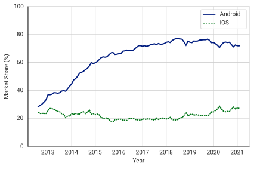
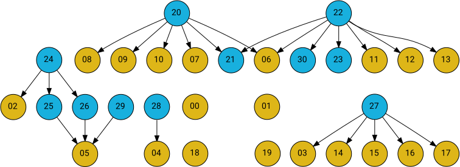

# Introduction

Smartphones have become an indivisible part of human life. They help us to organise our daily life, keep us informed and entertained. Due to our increased dependency on the smartphones, they contain rich information about their users' interests, behaviours and social circles. Any leakage of such information would impact the life of the users. A _malware_ is a software that threatens the security of a computer system (smartphone in this case) and privacy of its user [cite]. Depending on the intention of the malware author, the experience of being affected by a smartphone malware can range from increased battery consumption to entire smartphone being locked down and asking money in the form of ransom to unlock it.  

To impact a large number users and gain huge benefits, most malware tend to be targeted for a popular platform. In the smartphone scenario, Android is the most popular operating system, powering around 70% smartphones and tablets worldwide [cite]. Its adoption has consistency increased over the past decade as seen in the @fig:mobile-os-share, making it a favourable target of the malware.

{#fig:mobile-os-share}

Android malware are distributed in the form of Android Package (APK) files. Google Play Store ^[Play Store (URL: <https://play.google.com/store>, Accessed: 02 June 2021)] is the official platform for distributing APK files. The Google Play Protect service checks every APK in its repository whether it is a malware or not; however, it is not comprehensive [cite]. Apart from the Play Store, numerous third-party markets exist, which do not scan APKs for malware. It is also possible to install APKs without the need of a market, thus opening up several infection paths. Kaspersky Securelist ^[Securelist (URL: <https://securelist.com/mobile-malware-evolution-2020/101029>, Accessed: 02 June 2021)] detected 5,683,694 malware APKs in 2020. The huge magnitude of APKs make their manual analysis infeasible, promoting the need for an accurate, automated Android malware detection system.

## Android Malware Analysis Techniques

To detect Android malware, they have to be analysed to obtain a set of features that characterise their behaviour. Android malware analysis techniques can be broadly classified into static, dynamic and hybrid analysis based on the information they gather from the APK.

### Static Analysis

Static analysis extracts the features from the APK file without executing it. The APK file is a ZIP file containing several files that are required for the application (app) to function. Out of these files, following are important:

- `AndroidManifest.xml`: The manifest file, contains the permissions and hardware features required by the app to run, along with a list of app components.
- `classes.dex`: The app logic represented in the form of Dalvik Executable (dex) code, to be executed by the Android Runtime.
- `res/`: The media resources such as images and audio used by the app, which can also contain malware [cite].

Static analysis is faster and runs in predetermined time as it does not execute the APK and wait for several events to happen. However, the choice of static features is important as some static features are vulnerable to obfuscation techniques [cite].

### Dynamic Analysis

Dynamic analysis executes the APK file inside a sandbox and collects features during its execution. Dynamic analysis has to run for a sufficient time and requires suitable inputs so as to explore all possible execution paths of the app. Network traffic, file-system read/writes and resource usages are the important features that are extracted using the dynamic analysis [cite]. Although the dynamic analysis is resilient to obfuscation techniques, it is slow and, sometimes incomprehensive [cite].

### Hybrid Analysis

Hybrid analysis uses a combination of static and dynamic analysis to comprehend their respective limitations. By choosing a careful set of static and dynamic features, it is possible to capture the behaviour the app efficiently [cite].

## The Static Features

This work uses static analysis to detect Android malware. Several static features that can be extracted from the APK, without being specific to it, are discussed in this section.

### Permissions

Android restricts the usage of several hardware and software features by requiring permissions to use them. Android defines 179 permissions ^[Android Developers (URL: <https://developer.android.com/reference/android/Manifest.permission>, Accessed: 03 June 2021)] which are grouped into 12 permission groups ^[Android Developers (URL: <https://developer.android.com/reference/android/Manifest.permission_group>, Accessed: 03 June 2021)]. An app is required to list the permissions required by it in the manifest file. The permission list of a sample app is shown in @lst:permissions.

```{.xml caption="The permissions" #lst:permissions}
<uses-permission android:name="android.permission.ACCESS_COARSE_LOCATION"/>
<uses-permission android:name="android.permission.ACCESS_FINE_LOCATION"/>
```

The permission list provides an important and fast way to understand the intentions of an app [@Alazab2020; @Arp2014]. @Taheri2020 used bit-vectors derived from the permission usage as a feature vector. A similar approach is followed by [@Alazab2020] and [@Arp2014].


It has to be noted that the declaration of a permission in the manifest file doesn't enforce its usage, thus inducing false-positives in permission-based Android malware detection schemes [@Chen2020]. An app can collect a significant amount of private data without requring any permissions ^[PrivacyBreacher (URL: <https://github.com/databurn-in/PrivacyBreacher>, Accessed: 03 June 2020)]. Therefore, permissions alone are inefficient features for Android malware detection.

### The `dex` code

The `dex` code contains the app logic in the form of bytecodes. These bytecodes can either be used in the raw form, or parsed to get the methods $\mathcal{M}$, classes $\mathcal{C}$ and, relationships between them. @Ren2020 used the `dex` code in the raw form and interpreted the bytes of the `dex` code as the pixels of an image, resizing it wherever necessary to maintain its size fixed; they used image classifiers on the resulting image to detect Android malware. Using `dex` code in the raw form ignores structural relationships contained in it completely. The resizing done by @Ren2020 results in information loss.

Several graphs can be extracted from the `dex` code using the structural relationships contained in it. Some of them are as follows:

- **The Application Programming Interface (API) Call Graph**:  Captures the call order of API methods; contains fixed-number of nodes.
- **Control Flow Graph**: models the flow of the program control inside a method.
- **Function Call Graph (FCG)**: captures the caller-callee relationships between the methods $\mathcal{M}$ of the app; its size is depends on the size of APK.

The API Call Graph does not take to full account the code content of the user-defined methods. Similarly, the Control Flow is limited to the method-level. On the other hand, the FCG considers both API methods and user-defined methods; if appropriate attributes are assigned to every node of FCG and the relationships among API methods is added to it, then FCG captures the behaviour of the app as a whole.

### The FCG

FCG is a directed graph containing the methods $\mathcal{M}$ as its nodes and caller-callee relationships between them as edges. It is formally defined as follows:

:::definition

FCG $\Gamma(\mathcal{M}, E_\mathrm{calls})$ is a directed graph where,

- $\mathcal{M}$ is the set of all methods in the `dex` code,
- $E_\mathrm{calls}$ is the set of edges where $(m_i,m_j)\in E_\mathrm{calls}$ if $m_i$ calls $m_j$ in its code.

:::

To illustrate the concept of FCGs, a simple app has been used in this work, which involves two user interface elements - a button (class `Button` derived from class `View`) and a text view (class `TextView` derived from `View`). Whenever the user clicks on the button, a location tracker starts in the background and logs the location co-ordinates into the text view at fixed time interval. The screenshot of the app is shown in @fig:demoapp. The FCG of the its APK is shown in @fig:fcg.

:::{#fig:app_svg}

{width=35% #fig:demoapp}
{#fig:fcg width=65%}

A demo app and its FCG. The location co-ordinates are blurred to protect the privacy of its user.

:::

The methods in the dex code can be partitioned into *internal methods* $\mathcal{M}_\mathrm{internal}$ or *external methods* $\mathcal{M}_\mathrm{external}$ depending on whether their implementation is contained in the dex code or not, respectively. Thus, $\mathcal{M}=\mathcal{M}_\mathrm{internal} \cup \mathcal{M}_\mathrm{external}$ with $\mathcal{M}_\mathrm{internal} \cap \mathcal{M}_\mathrm{external} = \Phi$. 

FCGs can be of huge size depending on the size of the APK [@Liu2018]. Thus, many works used fixed-length features derived from the FCGs to detect Android malware [@Gao2019; @Wu2019; @Du2017], incurring loss of structural information. Graph Convolutional Networks (GCNs) [@Kipf2017] allow the use of arbitrarily large graphs with fixed-size node attributes and were used by @Cai2021; @Yang2021 to detect Android malware.

## Graph Convolutional Networks

GCNs are a family of deep learning algorithms that take an **attributed graph** (A graph with fixed-size attributes assigned to every node), and propagate their node-attributes along the edges and aggregating them at every node to update their attributes, while tuning their learnable parameters for a particular task. Most of the GCN algorithms fall into the general framework of Message Passing Neural Networks (MPNNs) [@Gilmer2017]. Further sections provide an overview of MPNN frameworks with description of some popular algorithms following it. 

### The MPNN Framework

The MPNN framework defines following primitives and operations:

- **"Message" primitive** $\mathfrak{M}$ - computed on every edge with source node and destination node as its arguments
- **Reduction operator $\rho$** - aggregates incoming messages into a node; must be *order-invariant* (such as $\mathrm{sum}$, $\mathrm{max}$ and $\mathrm{mean}$). 

- **"Update" primitive $\mathfrak{U}$** - updates node features based on its previous features and aggregated messages.

Using the MPNN framework, the operation of a generic GCN algorithm at layer $l$ on a graph $G(V,E)$, updating the features of node $u$ with attribute $\mathbf{h}_u^{(l)}$ with neighbours $\mathcal{N}(u)$ can be represented as follows.

$$
\mathbf{m}_e^{(l+1)} = \mathfrak{M}(u,v), \forall~ e=(u,v)\in E
$$ {#eq:mpnn_message}

$$
\mathbf{r} = \rho\Big(\Big\{ \mathbf{m}_e^{(l+1)}|\ e=(v,u) ~\forall v\in \mathcal{N}(u) \Big\}\Big)
$$ {#eq:mpnn_reduce}

$$
\mathbf{h}_u^{(l+1)} = \mathfrak{U}(\mathbf{h}_u^{(l)}, \mathbf{r})
$$ {#eq:mpnn_update}

@eq:mpnn_message calculates the message $\mathbf{m}_e$ between all edges $e$ of the graph. The messages *addressed* to the node $u$ are aggregated in @eq:mpnn_reduce. The node $u$ updates its attribute using its previous attribute and reduced messages in @eq:mpnn_update. The learnable parameters of the GCN can be present in any of these stages.

### GCN Algorithms following the MPNN Framework

Some popular GCN algorithms are represented in terms of MPNN framework in @tbl:mpnn_list.

:::small

| Algorithm                  | $\mathbf{m}_e^{(l+1)} = \mathfrak{M}(u,v)$                   | $\mathbf{r} = \rho\left(\left\{ \mathbf{m}_e^{(l+1)}\right\}\right)$ | $\mathbf{h}_u^{(l+1)} = \mathfrak{U}(\mathbf{h}_u^{(l)}, \mathbf{r})$ |
| ------------------------------- | --------------------------- | --------------------------- | --------------------------- |
| `GraphConv` [@Kipf2017]    | $\kappa\cdot\mathbf{h}_v^{(l)}\mathbf{\Theta}^{(l)}$^[$\kappa$ is a normalisation constant, $\kappa=\left(|\mathcal{N}(u)|\times|\mathcal{N}(v)|\right)^{-0.5}$] | $\mathrm{sum}$                                               | $\sigma(\mathbf{r})$                                         |
| `SAGEConv` [@Hamilton2017] | $\mathbf{h}_v^{(l)}$                                         | $\mathrm{mean}$                                              | $\sigma(\mathbf{\Theta}\cdot\mathrm{concat}(\mathbf{h}_u^{(l)}, \mathbf{r}))$ |
| `DotGATConv`^[A simplification of the `GATConv` algorithm [@Velickovic2018] ] | $\alpha_{u,v} \mathbf{h}_v^{(l)}$^[$\alpha_{u,v}$ is the attention score between $u$ and $v$, $\alpha_{u,v} = \mathrm{softmax}_v\left(e_{u,v}^{(l)}\right)$ where $e_{u,v}^{(l)} = \left(\mathbf{\Theta}_u^{(l)}\mathbf{h}_u^{(l)}\right)^T\cdot \mathbf{\Theta}_v^{(l)} \mathbf{h}_v^{(l)}$.] | $\mathrm{sum}$ | $\mathbf{r}$ |

: Some popular GCN algorithms expressed in terms of MPNN Framework. $\mathbf{\Theta}$ represents the learnable parameters of the network and $\sigma$ can be any activation function. {#tbl:mpnn_list}

:::


### Other GCN Algorithms

Some 
